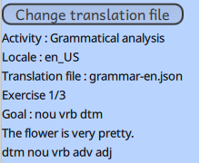
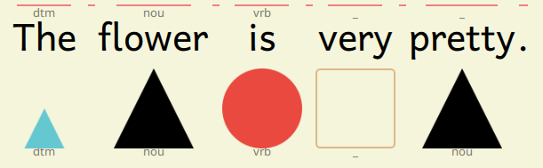

**GCompris** - Activités grammar_classes et grammar_analysis.\
**Notes aux traducteurs.**

[[_TOC_]]

# Fichiers de traduction

Pour tester votre fichier de traduction :

* Copier les fichiers d'exemples : [grammar_analysis-xx.json](grammar_analysis-xx.md) et [grammar_classes-xx.json](grammar_classes-xx.md) dans le répertoire `$HOME/.local/share/GCompris/`.
* Quand ces fichier existent, ils seront utilisés par défaut par GCompris.

## Précautions d'écriture des fichiers au format JSON

- Les fichiers JSON sont très sensibles aux erreurs d'imbrication des guillemets `""`, accolades `{}` et crochets `[]`.
- Les éléments des listes doivent être séparés par des virgules `,`.
- Le dernier élément d'une liste ne doit pas être suivi d'une virgule.
- Le format JSON n'accepte pas les lignes de commentaires.

En cas d'erreur de ce type, vous verrez un message au lancement de l'activité.\
Pour situer l'erreur dans votre fichier.
- Soit votre éditeur de texte intelligent vous montre l'endroit du problème.
- Le navigateur Firefox peut vous aider à valider un fichier JSON. Ouvrir le fichier sur votre ordinateur depuis Firefox, s'il s'affiche c'est qu'il est correct, sinon un message vous indique la ligne où se situe le problème.
- Sinon vous pouvez utiliser des analyseurs JSON en ligne comme [celui-ci](https://jsonformatter.org/json-parser).

Copier/coller l'intégralité de votre document JSON dans le Parser, vous obtiendrez une description et une localisation précise de l'erreur.\
Exemple : `JSON.parse: expected ',' or '}' after property value in object at line 78 column 5 of the JSON data`.

## Structure d'un fichier de traduction

Un fichier de traduction est composé des 3 parties suivantes :

    {
      "levels": [...],
      "dataset": {...},
      "syntax": [...]
    }

Dans chaque fichier, les clés ne doivent pas être traduites (à gauche du ":"), seulement le contenu des valeurs est à modifier.

## Déclaration de la syntaxe

Les classes grammaticales de votre langue sont déclarées dans la partie `syntax` des fichiers.\

    "syntax" : [
      { "code": "nou",
        "wordClass": "Noun",
        "image": "1.svg"
      },
      { "code": "dtm",
        "wordClass": "Determiner",
        "image": "2.svg"
      }, ...
    ]

Chaque classe grammaticale est définie par trois valeurs

- `code`    - qui codera pour la classe grammaticale dans les solutions des exercices (trois lettres conseillées, mais la longueur est libre).
- `wordClass`   - le nom de la classe grammaticale qui sera affiché.
- `svg`     - l'image qui symbolisera cette classe. L'image doit exister dans le répertoire `resource/svgs/` de l'activité `grammar_analysis`.

Chaque traducteur peut définir son propre "langage grammatical" dans sa langue.\
Il peut supprimer une classe inutile dans sa langue ou en rajouter si besoin.\
L'ordre de présentation des classes à l'écran sera celui de la section `syntax`.\
L'équipe de GCompris pourra ajouter de nouveaux symboles si besoin.

### Classes grammaticales de base

    nom
    determinant
    adjectif
    pronom
    verbe
    adverbe
    conjonction
    preposition
    interjection

### Images par défaut
- `1.svg`: black triangle, used for nouns in English.
- `2.svg`: small light blue triangle, used for determinants in English.
- `3.svg`: medium blue triangle, used for adjectives in English.
- `4.svg`: purple triangle, used for pronouns in English.
- `5.svg`: red circle, used for verbs in English.
- `6.svg`: small orange circle, used for adverbs in English.
- `7.svg`: pink rectangle, used for conjunctions in English.
- `8.svg`: green arc, used for prepositions in English.
- `9.svg`: yellow exclamation point, used for interjections in English.

## Description des exercices

Les exercices sont décris dans la partie `dataset` des fichiers.

### Les groupes d'exercices

Chaque exercice est déclaré à l'intérieur d'un groupe nommé.\
Les fichiers donnés en exemples comportent trois groupes `small`, `medium` et `large` pour représenter la longueur des phrases proposées.\
Ces noms de groupes sont totalement arbitraires et chaque traducteur peut les renommer, en rajouter ou supprimer.\
Le nombre d'exercices par groupe n'est pas contraint, les listes sont extensibles.

    "dataset" : {
      "small" : [
        { "sentence": "This vanilla cream smells very good."
        , "answer":   "dtm nou nou vrb adv adj"
        }, ...
      ],
      "medium" : [
        { "sentence": "The entrance to the college is inaccessible until further notice."
        , "answer":   "dtm nou     ppt dtm nou     vrb adj         ppt   adj     nou"
        },...
      ]
    }

### Les exercices

Chaque exercice est composé de la phrase proposée et de son analyse syntaxique complète.

      { "sentence": "The magpie wanders on the balcony."
      , "answer":   "dtm nou vrb ppt dtm nou"
      },
      { "sentence": "(Ding dong)! The doorbell rings."
      , "answer":   "    itj      dtm nou      vrb"
      },
      { "sentence": "GCompris."
      , "answer":   "prn+vrb+vrb"
      },
      { "sentence": "花 は とても きれいです。"
      , "answer":   "nou vrb adv adj"
      }      

### Règles de syntaxe

* Les espaces multiples sont supprimés dans `sentence` et `answer`.
* Les signes de ponctuation ne sont pas pris en compte.
* Plusieurs mots peuvent être regroupés en un seul par des parenthèses (mais pas d'imbrication de parenthèses).
* Certaines langues permettent de fusionner plusieurs mots en un seul. Utiliser l'opérateur `+` entre les classes. Exemple: `nou+adj.`
* Le nombre de mots et de classes grammaticales doivent être identique entre `sentence` et `answer`.
* Pour les langues n'utilisant pas d'espace pour séparer les mots, GCompris a besoin de reconnaître chaque mot pour identifier sa classe grammaticale. GCompris se charge de supprimer les espaces avant de présenter l'exercice. La phrase de l'exemple ci-dessus sera présentée ainsi : `花はとてもきれいです。`.

### Gestion des caratères espace

La gestion des espaces permet au traducteur d'aligner visuellement mots et codes grammaticales.

    { "sentence": "The magpie wanders on the balcony."
    , "answer":   "dtm nou    vrb    ppt dtm nou"
    }

Dans le cas des écritures RTL, il est préférable d'utiliser un code syntaxique dans la même écriture pour conserver l'orientation, l'ordre et l'alignement entre question et réponse.

    { "sentence": "הפרח יפה מאוד."      // right to left
    , "answer":   "שם פועל תואר"        // right to left
    },

## Les niveaux

Les niveaux sont déclarés dans `levels` pour chaque activité.

    "levels": [
      {
        "objective": "Find nouns and verbs.",
        "difficulty": "1",
        "exercise": "small",
        "goal": "nou vrb"
      },
      {
      "objective": "Find nouns, verbs and determinants.",
        "difficulty": "1",
        "exercise": "small",
        "goal": "nou vrb dtm"
      },

Chaque niveau est défini par quatres valeurs :

- `objective`    - le titre présenté pendant l'activité.
- `difficulty`   - le niveau de difficulté (par géré pour l'instant).
- `exercise`     - le nom du groupe d'exercices à utiliser.
- `goal`         - la liste des classes grammaticales à identifier.

Tous les exercices du groupe choisi seront présentés. Pour chacun il faudra trouver les classes demandées.\
Les niveaux sont numérotés et présentés dans l'ordre du fichier.

### Remarques

Les niveaux de chaque activités ne sont pas identiques.

Dans `grammar_classes` une seule classe est proposée à l'élève. S'il `goal` contient plusieurs classes, seulle la première sera utilisée.

Dans `grammar_analysis`, tous les mots peuvent recevoir une classe grammaticale. Au moins une classe de `goal` doit être présente dans la phrase.

### Brassage des exercices

L'ordre de présentation des exercices de chaque `dataset` sera modifié au hasard lors de la présentation aux élèves.\
Pour les traducteurs, l'ordre des `dataset` est respecté.

# Contrôle syntaxique

Il y a plusieurs niveaux de vérification syntaxique.

## Au démarrage de l'activité :

* Syntaxe du fichier JSON (voir plus haut).
* Présence des 3 parties principales (`levels`, `dataset` et `syntax`).

Dans ces deux cas il y aura un message d'erreur, mais l'activité ne présentera aucun exercice.

## Pour chaque exercice :

* Vérification que le compte de mots de `sentence` et le compte des classes grammaticales de `answer` est identique.
* Vérification que les classes grammaticales données dans `goal` et `answer` existent bien dans `syntax`.

Un message d'erreur vous informera des problèmes en arrivant sur l'exercice.

# Le mode traduction

Les traducteurs ont accès à des fonctionnalités d'aide à la mise au point des fichiers de traductions.\
Ces fonctionnalités seront activées pendant la phase de traduction.

Activer le mode "aide aux traducteurs" avec les touches `Ctrl+Alt+Return`.\

## Informations générales

En haut à gauche une série d'informations sur l'exercice en cours :

- Le nom de l'activité.
- La langue locale
- Le nom du fichier de traduction utilisé.
- Le numéro d'exercice courant.
- Le `goal` de l'exercice.
- La `sentence` proposée (nettoyée de ses parenthèses).
- L'analyse grammaticale `answer` associée.

## Informations sur chaque mot de la phrase

- Les traits au-dessus de la phrase permettent de visualiser les mots, les espaces de séparation et la ponctuation. Les intervalles entre les mots n'interviennent pas dans l'activité mais sont représentées dans ce mode.
- Au-dessus des mots, la (ou les) classes(s) attendues. Un `_` signifie qu'une réponse vide est attendue.
- En-dessous du cadre, la réponse actuelle donnée par l'élève.
