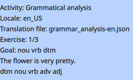
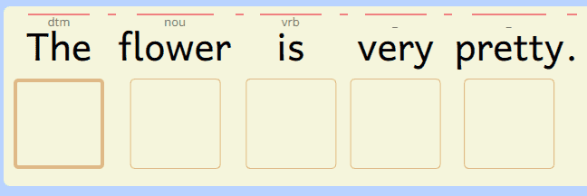

**GCompris** - grammar_classes and grammar_analysis activities.\
**Instructions to create new content.** 

[[_TOC_]]

# Testing your files

To start and test your translated files:

* Copy the example files: [grammar_analysis-xx.json](examples/grammar_analysis-xx.json) and [grammar_classes-xx.json](examples/grammar_classes-xx.json) in the directory depending on your operating system (on Linux, it is `$HOME/.local/share/GCompris/`, on Windows it is `C:\Users\Username\AppData\Local\gcompris\`, on Android it is `/Android/data/net.gcompris.full/files/GCompris/`).
* When those files exist, they will be used by default by GCompris.
* Edit the content of those files for your language, starting with the `syntax` section at the end of the file, then the `dataset` section and then the `levels` section. Read below for more details on each section.

## Precautions when writing JSON files

- JSON files must not have any error in the position of quotes `""`, curly brackets `{}` and square brackets `[]`.
- Items in lists must be separated by a comma `,`.
- The last item of a list must not be followed by a comma.
- The JSON language does not contain comments.

If your file contains that kind of mistake, you will see an error message when starting the activity.\
To locate the errors in your file:
- If you use an advanced text editor it may show you where the problem is.
- The Firefox browser can help you validate a JSON file. Open the file with Firefox, if it's displayed it means it is correct, else a message will tell you on which line the problem is.
- You can use some online JSON analysis tools like [this one](https://jsonformatter.org/json-parser).

Copy/Paste all the content of your JSON file in the parser, you will get a description of the error.\
Example : `JSON.parse: expected ',' or '}' after property value in object at line 78 column 5 of the JSON data`.

## Structure of a JSON file

A JSON file is composed of 3 parts:

    {
      "levels": [...],
      "dataset": {...},
      "syntax": [...]
    }

In each file, the keys must not be changed (on the left side of ":"), only the content of the values on the right side must be changed.

## Declaring the syntax

The grammatical classes of your language must be defined in the `syntax` part.\

    "syntax" : [
      { "code": "nou",
        "wordClass": "Noun",
        "image": "1.svg"
      },
      { "code": "dtm",
        "wordClass": "Determiner",
        "image": "2.svg"
      }, ...
    ]

Each grammatical class is defined by 3 values:

- `code` - this is used to name the grammatical class in the exercises solutions (we advise to use a 3 letters length code, but you can use any length).
- `wordClass` - this is used for the actual name of the grammatical class which will be displayed.
- `image` - the image which will be used to represent this class. It must be one of the images in the directory `resource/svg/` of the `grammar_analysis` activity (you can find the list of images below in the `Available images` section).

This way you can define the list of grammatical classes in your language.\
You can delete a class which is not used in your language or add new ones if needed.\
The classes will be displayed in the same order as they are declared in the `syntax` section.\
If there are not enough images to represent all your classes, let us know and we will add new ones as needed.

### Base grammatical classes

    noun
    determiner
    adjective
    pronoun
    verb
    adverb
    conjunction
    preposition
    interjection

### Available images
- `1.svg`: black triangle, used for nouns in English.
- `2.svg`: small light blue triangle, used for determiners in English.
- `3.svg`: medium dark blue triangle, used for adjectives in English.
- `4.svg`: purple triangle, used for pronouns in English.
- `5.svg`: red circle, used for verbs in English.
- `6.svg`: small orange circle, used for adverbs in English.
- `7.svg`: pink rectangle, used for conjunctions in English.
- `8.svg`: green arc, used for prepositions in English.
- `9.svg`: yellow exclamation mark, used for interjections in English.
- `10.svg`: inverted small light blue triangle, not used in English.

## Exercises definition

The exercises are defined in the `dataset` part.

### Exercises groups

Each exercise is defined inside of a named group.\
The example files contain 3 groups `small`, `medium` and `large` to represent the length of the sentences.\
These names are a suggestion but if you want you can rename them, delete some or add new ones.\
You can add as many exercises as you want in each group.

    "dataset" : {
      "small" : [
        { "sentence": "This vanilla cream smells very good."
        , "answer":   "dtm nou nou vrb adv adj"
        }, ...
      ],
      "medium" : [
        { "sentence": "The entrance to the college is inaccessible until further notice."
        , "answer":   "dtm nou     ppt dtm nou     vrb adj         ppt   adj     nou"
        },...
      ]
    }

### Exercises

Each exercise is composed of a sentence and an answer containing its full syntax analysis.

      { "sentence": "The magpie wanders on the balcony."
      , "answer":   "dtm nou vrb ppt dtm nou"
      },
      { "sentence": "(Ding dong)! The doorbell rings."
      , "answer":   "    itj      dtm nou      vrb"
      },
      { "sentence": "花 は とても きれいです。"
      , "answer":   "nou vrb adv adj"
      }    

### Syntax rules

* You can add multiple spaces in `sentence` and `answer`, they will be automatically deleted.
* Punctuation signs are not considered.
* Multiple words can be grouped together with parenthesis, like in `(Ding dong)` (but they should be nested).
* Some languages allow to combine several words into one word, with each part of the word keeping its own class. In this case, use the operator `+` between the classes. Examples: `(Isn't) it?` = `vrb+adv prn`, `ശേഷം ആനയോടി.` = `avyayam naamam+kriya`.
* The number of words in a `sentence` should be the same as the number of grammatical classes in `answer`.
* For languages which don't use spaces to separate words, we still need to have spaces between words to identify them in `sentence`. The activity will take care of deleting the spaces before displaying the sentences. The last sentence of the example above will be displayed as `花はとてもきれいです。`.

### Space characters management

If you want you can use space characters to align visually to words and their grammatical codes.

    { "sentence": "The magpie wanders on  the balcony."
    , "answer":   "dtm nou    vrb     ppt dtm nou"
    }

For languages with RTL writing systems, it may be better to use syntax codes in the same writing system to keep the same direction, order and alignment in a `sentence` and its `answer`.

    { "sentence": "הפרח יפה מאוד."      // right to left
    , "answer":   "שם פועל תואר"        // right to left
    },

## Levels

Levels are defined in the `levels` part for each activity.

    "levels": [
      {
        "objective": "Find nouns and verbs.",
        "difficulty": "1",
        "exercise": "small",
        "goal": "nou vrb"
      },
      {
      "objective": "Find nouns, verbs and determinants.",
        "difficulty": "1",
        "exercise": "small",
        "goal": "nou vrb dtm"
      },

Each level contains 4 values:

- `objective`    - the description displayed in the activity.
- `difficulty`   - the difficulty level (not used for now).
- `exercise`     - the name of the exercise group to use.
- `goal`         - the list of grammatical classes to identify.

When the translationMode is activated, all the sentences in the exercise group will be displayed for the level. Else for users, sentences are filtered to use only relevant sentences (see below for the details).

### Notes for each activity

`grammar_classes` is meant to learn each class separately, so the `goal` must contain only one class to identify. If the `goal` contains several classes, only the first one will be used.\
The content of the exercise group will be filtered to use only sentences which contain the class to identify in `goal`.

`grammar_analysis` is meant to analyze all the words in a sentence, so the `goal` must contain several classes to identify, possibly all of them.\
The content of the exercise group will be filtered to use only sentences which contain at least one class to identify in `goal`.

### Exercises order

When the translationMode is activated, the exercises will be displayed in the same order as they are defined in the JSON files.

Else for users, the exercises order will be shuffled to display the sentences in random order.

# Syntax check

There are several levels of syntax check.

## When starting the activity:

* Check if the syntax of the JSON file (as described above) is correct.
* Check if the 3 main parts (`levels`, `dataset` et `syntax`) are defined.

In both cases, if there is an error, you will see an error message, and the activity will not load any exercise.

## For each exercise:

* Check that the words count in `sentence` and the count of grammatical codes in `answer` are identical.
* Check that the grammatical classes in `goal` and `answer` exist in `syntax`.

An error message will tell you if there is any problem when loading an exercise.

# The translation mode

People writing JSON files have access to features to help testing the files.
Those features are available when the `translation mode` is activated at compilation time. We will provide special builds with this mode activated.

The shortcuts `Alt+Right` and `Alt+Left` load respectively the next and previous exercise.

You can activate the "debug information" with the shortcut `Ctrl+Alt+Return`.\
When "debug information" is activated, you will see the following extra info.

## General information

On the top-left of the screen, some info about the running exercise:

- The name of the activity.
- The selected locale.
- The name of the JSON file used.
- The number of the exercise displayed.
- The `goal` of the exercise.
- The `sentence` displayed.
- The corresponding `answer`.

## Info about each word of the sentence

- The lines above the sentence allow to visualize the words, the separation spaces and the punctuation.
- Above the words, the requested classes for the corresponding slots. A `_` means an empty slot is expected.
