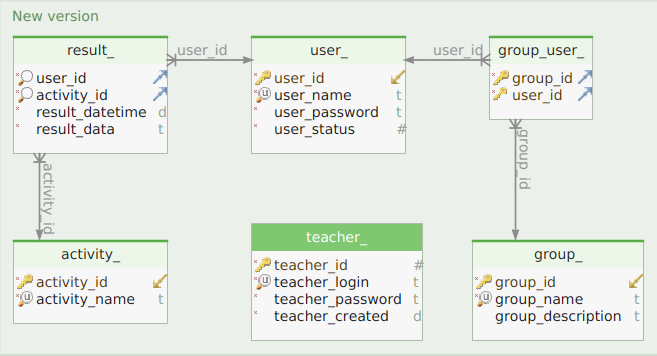
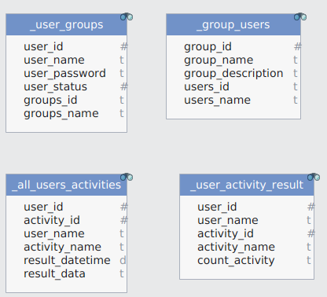
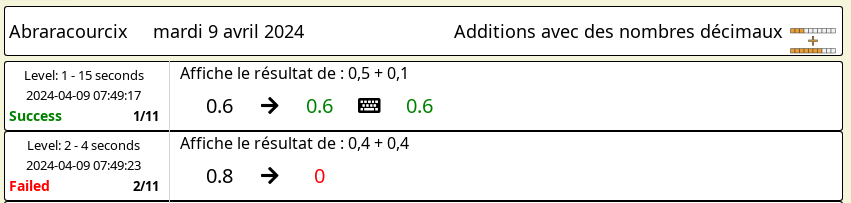
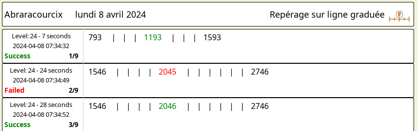
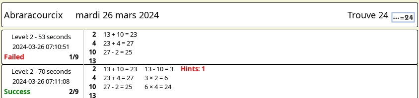

# GCompris serveur

[[_TOC_]]

## Conventions de nommage de la base de données.

### Tables

On en a discuté avec Johnny et décidé de suffixer les noms de tables avec un souligné.\
Les tables actuelles s'appellent `user_, group_, teacher_, group_user_, activity_, result_`.\
Il y a des indexs et des contraintes sur les colonnes.\
Les colonnes `user_name` ou `group_name` ont des contraintes d'unicité. C'est Sqlite qui génère les erreurs.

Les noms de colonnes sont préfixés avec le nom de la table (la structure a changé depuis cette copie d'écran).

### Vues (sql)

Les vues seront préfixées par un souligné `_user_groups, _user_activity_result`, etc.\
Les tables ne devraient plus beaucoup bouger. Le nombre de vues va sûrement augmenter.

Les scripts de création des tables et des vues sont dans **/src/server/database/**.

    create_tables.sql
    create_views.sql

Exemple de vue :

    CREATE VIEW _user_groups AS
        SELECT user_.user_id, user_name, user_password
             , group_concat(group_user_.group_id) AS groups_id, group_concat(group_name) as groups_name
          FROM user_, group_, group_user_
         WHERE group_user_.group_id=group_.group_id
           AND user_.user_id=group_user_.user_id
        GROUP BY user_.user_id
    UNION
        SELECT user_.user_id, user_name, user_password, NULL AS groups_id, NULL AS groups_name
          FROM user_
         WHERE user_id NOT IN (SELECT DISTINCT user_id FROM group_user_);

Cette vue est l'union de deux requêtes qui combinent les `user_` affectés à des groupes et ceux présents dans aucun groupe.\
Les colonnes renvoyées sont nommées `user_id, user_name, user_password, user_status, groups_id, groups_name`.
`groups_id` et `groups_name` (au pluriel) contiennent les identifiants et noms de groupe, séparés par de virgules.

Ces colonnes vont servir à nommer les propriétés dans les `ListModel`.

## ListModel ou array javascript ?

J'ai trouvé sur internet une fonction qui reçoit en paramètre une requête et renvoie les lignes et colonnes dans un objet Json.\
Ça s'appelle `selectToJson` dans `database-controller.cpp`. J'ai remarqué que si on affectait ce Json à un modèle d'un objet Qml, ça avait l'air de marcher.

Dans cet article [Sorting QML ListModels](https://community.esri.com/t5/arcgis-appstudio-blog/sorting-qml-listmodels/ba-p/895823) on trouve dans le paragraphe 3 ces explications très intéressantes :

***3. ListModel vs Array***

***If you compare the ListModel QML Type with the Javascript Array type, you'll find that Array has better methods. In particular, Array has a sort method whilst ListModel does not.***

***When you assign an Array to a QML visual component, e.g. ListView, the Array behaves like a scalar value. If you were to push new records onto the Array the ListView will not update. There is no property binding between pushes to the Array and the ListView. To refresh the ListView you need to reassign the Array every time the Array changes. This will cause the ListView to repaint. This could lead to bad user experience. For instance, I may be writing an application that collates results from an online search. The results may arrive through a series of NetworkRequests to REST API end points. Each update will cause the ListView to repaint and scroll back to the top. This will be particularly annoying to the user if the user was already reading and scrolling through the results.***

***The experience is different with ListModels. When you assign a ListModel to a ListView you don't need to assign it again. When you append new records to the ListModel, the ListView will receive sufficient change notification and will automatically update to reflect that new records have arrived. If the ListModel were to change whilst the user was reading and scrolling through the ListView, the current scrolled position and the selected item will be unchanged. The user would not experience any negative user experience with the ListView.***

Le `ListModel` est donc la meilleure solution, et transformer un tableau d'objets javascript en `ListModel` n'est pas très difficile :

    function modelFromRequest(model, request) {
        model.clear()
        var jsonModel = JSON.parse(databaseController.selectToJson(request))
        for (var i = 0; i < jsonModel.length; i++)
            model.append(jsonModel[i])
    }

Voilà de quoi alimenter directement les modèles avec le résultat des requêtes.

## Convention de nommage des propriétés Qml et des ListModel.

Du coup, les propriétés des éléments des modèles portent le nom des colonnes de la requête, et c'est bien pratique.\
La requête `_user_groups` crée directement un `ListModel` avec les propriétés  `user_id, user_name, user_password, user_status, groups_id, groups_name`.

Toutes ces valeurs ne sont pas toujours utiles, mais elles seront disponibles automatiquement dans le modèle.

J'ai pris l'habitude de nommer les propriétés Qml qui reçoivent ces valeurs de cette façon : `user_Id, user_Name, user_Password` avec une majuscule. Un mélange de camelCase et de snake_case.\
On peut remplir les `Listview, Gridview` et `Tableview` facilement.

    model: groupModel
    property int group_Id: group_id
    property string group_Name: group_name
    property string group_Description: group_description

Lors d'un passage de paramètres on reste avec le camelCase standard : `userId, userName, userPassword`.

    function createGroup(groupName, groupDescription)

Ces conventions se sont imposées d'elles-mêmes au fur et à mesure du codage. Peut-être qu'elles ne sont pas appliquées strictement partout.

## Pseudo colonnes

On peut ajouter au colonnes d'un requête des *pseudo colonnes*, non présentes dans la base mais utiles dans le `ListModel`.

Il faut pour ça adapter `modelFromRequest` pour l'ajout de colonnes supplémentaires.\
`Object.assign` effectue une union des deux objets :

    function modelFromRequest(model, request, add = {}) {
        model.clear()
        var jsonModel = JSON.parse(databaseController.selectToJson(request))
        for (var i = 0; i < jsonModel.length; i++) {
            model.append(Object.assign(jsonModel[i], add))
        }
    }

    function loadUsers() {
        modelFromRequest(userModel, "SELECT * FROM _user_groups ORDER BY user_name", { user_checked: false, user_status: 0})
        ...
    }

Le nom de ces colonnes sont formatées comme les noms des colonnes venues de la base.\
`user_checked` sert à stocker l'état `checked` des items des `View`.\
Dans le cas d'une longue liste (comme celle des élèves), on ne peut tester l'état `checked` des items que si ceux-ci sont affichés.
La valeur de `user_checked` est mise à jour comme ça dans le `ListView` :

    onCheckedChanged: Master.filteredUserModel.setProperty(index, "user_checked", checked)

## Protocol réseau

Les échanges se font dans le format `Json` et commencent par un identifiant de type de message :

    { "aType": int,
      "content": array or object
    }

`aType` est defini par les constantes suivantes, accessible en C++ et en Qml :

    enum MessageType : int  {
        LOGIN_LIST,
        LOGIN_REPLY,
        LOGIN_ACCEPT,
        DISCONNECT,
        ACTIVITY_DATA,
        PING,
        PONG
    };

### Mécanisme de polling

En cas de coupure réseau (logicielle ou physique), rien ne permet à un socket TCP de s'en apercevoir.\
La seule façon de faire, c'est du polling.

Le client va vérifier cycliquement que le serveur est toujours présent (PING).\
Le serveur va également vérifier qu'il reçoit bien un PING et répondra par un PONG.\
S'il ne reçoit plus de message, ni de PING, il ferme la connexion ouverte par le client.

Le serveur a un timer unique pour toutes les sockets.\
À chaque réception de données d'un client, le serveur note l'heure d'arrivée du message (en millisecondes).\
Si un client n'a pas envoyé de message depuis WAIT_DELAY, la connexion avec ce client est fermée par le serveur.

En cas de coupure réseau, les résultats d'activités sont mis dans une file d'attente dans le client.\
Pour pourvoir rétablir une connexion coupée, le client mémorise maintenant le ServerId, le login et le mot de passe de l'élève à la première connexion.\
Régulièrement, le client va tenter de rétablir la connexion avec le serveur puis de renvoyer login et mot de passe.\
À la reprise de connexion, les messages en file d'attente sont envoyés au serveur.\
Quand un message est envoyé, il n'y a pas de PING.

Voilà l'idée. Il n'y a qu'à vérifier que l'implémentation fait bien cela.

Les timeouts ont été affectés de façon pifométrique. Les valeurs actuelles sont :

    PING_DELAY = 500;      // Timeout between pings. Check connection (client side)
    WAIT_DELAY = 1000;     // Timeout without message or ping received, before closing socket (server side)
    PURGE_DELAY = 100;     // Timeout between messages, while purging message queue after reconnection (client side)

Il faudra voir comment ça se passe avec 30 ou 50 clients connectés pour ne pas surcharger le serveur de pings.\
`PURGE_DELAY` est court, pour vider rapidement la file d'attente. Même question si tous les clients se reconnectent d'un coup ?\
Il y a aussi le cas où le serveur serait une machine un peu faible.

### Détail des échanges réseau

**LOGIN_LIST** :  `content : array[string]`\
*Server to Client*

    { "aType": 0,
      "content": [ "Abraracourcix","Achille Talon" ... ,"Tchang","Tintin"]
    }

**LOGIN_REPLY** :  `content : { login: string, password: string }`\
*Client to Server*

    { "aType": 1,
      "login": "Tintin",
      "password: "1234"
    }

**LOGIN_ACCEPT** :  `content : { accepted: bool, user_id: int }`\
*Server to Client*

    { "aType": 2,
      "accepted": true,
      "user_id: 8
    }

**DISCONNECT** : \
*Server to Client*

    { "aType": 3 }

**ACTIVITY_DATA** :  `activity: string, content: { object }`\
*Client to Server*

    { "aType": 4,
      "activity": "grammar_classes/GrammarClasses.qml"
      "content": { ... }   //  activity_json_object. Different for each activity
    }

**PING** : \
*Client to Server*

    { "aType": 5 }

**PONG** : \
*Server to Client*

    { "aType": 6 }

## Mécanisme de patch de la base de données

Le schéma de la base de données va être amené à changer. Surtout pendant la phase de développement mais aussi après.\
Le code de `database_controller.cpp` contient un numéro de version dans `DB_VERSION` (à gérer à la main).

Quand un nouvel enseignant est créé, la base de données est créée avec les scripts `create_tables.sql` et `create_views.sql`.
Les scripts de création doivent être à jour de la version.\
Le numéro de la version courante est stocké dans `teacher_.teacher_dbversion`.

Si la version a changée (passage de 2 à 5), les patchs 3, 4 et 5 sont appliqués sur la base (`patch_3.sql`, ... dans `database/`).\
Le nouveau numéro de version est inscrit dans `teacher_`.\
Chaque patch est exécuté à l'intérieur d'une transaction Sql.\
On ne devrait pas perdre de données à l'avenir avec une mise à jour.

C'est **DbSchema** (même en version bridée) qui permet de produire facilement les scripts de mise à jour.

## Chiffrage des données

Sqlite n'offre pas de moyen de chiffrage des données global, ni de protection de la base par un mot de passe.\
Il faut donc chiffrer certaines colonnes texte (noms, description, mot de passe).\
Les résultats des activités ne seront pas chiffrés parce qu'ils contiennent des données Json à l'intérieur desquelles on fera des requêtes.

Dans la phase de développement, ce n'est pas très pratique d'avoir des données chiffrées pour déboguer.\
Il y a maintenant un flag `teacher_.teacher_dbcrypted` qui indique si les données sont chiffrées ou pas.\
Ce flag sera donné au moment de la création de la base. Il ne pourra plus être changé par l'application.\
Ça permettra d'avoir des bases chiffrées ou pas pour les tests.

Le bouton de création de base de données propose maintenant un dialogue avec une option de chiffrage.

### Données chiffrées actuellement

Colonnes des tables

    user_name
    user_password
    group_name
    group_description

Colonnes des vues

    users_name
    groups_name

Les noms des activités ne sont pas chiffrés, ni les résultats des activités.\
Ça permettrait de sortir des données anonymisées avec les deux tables `activity_` et `result_`.

## Structure des répertoires, nommage des fichiers

Répertoires de `server/` contenant des fichiers Qml.

    ├── activities
    ├── components
    ├── dialogs
    ├── panels
    ├── singletons
    └── views
        ├── charts
        └── datas

`dialogs` contient des fichiers nommés `*Dialog.qml`.\
`panels`  contient des fichiers nommés `*Panel.qml`.\
`views`  contient des fichiers nommés `*View.qml`.\
`datas`  contient des fichiers nommés `*Data.qml`.\
`charts`  contient des fichiers nommés `*Chart.qml`.

`activities` contient un répertoire par activité, qui porte le même nom que dans GCompris.\
Dans chaque répertoire, un fichier `DataDisplay.qml` obligatoire qui sera appelé par `ActivitiesView.qml`.\
Voir dans les répertoires `grammar_*` comment partager le même traitement entre deux activités.

Autres répertoires de `server/`.

    ├── database                  (.sql)
    ├── doc                       (.md)
    ├── resource                  (fonts, images)
    └── serverMasterController
        ├── config                (.h, .cpp)
        └── controllers           (.h, .cpp)

Le document suivant est généré à partir du script `generate-doc.php`.\
Dans un shell, depuis le répertoire `gcompris/serc/server/doc/`, entrer `php generate-doc.php` pour le mettre à jour.

[Hiérarchie d'imbrication des objets Qml](GCompris-Server.md)

## Ajouter une trace serveur à une activité existante

### Côté activité

#### Dans le fichier Qml

Ajouter un objet `Client` dans l'activité et définir sa fonction `getDataCallBack`.\
C'est elle qui détermine les données renvoyées au serveur.\
L'exemple ci-dessous vient de l'activité `learn_decimals`. Les données renvoyées peuvent être très différentes d'une activité à l'autre.\
Au développeur de voir ce qui est utile.

    Client {
        id: client
        getDataCallback: function() {
            var data = {
                "question": questionAsked.text,
                "expected": Activity.correctAnswer,
                "proposal": Activity.userAnswer,
                "input": answerBackground.userEntry 
            }
            return data
        }
    }

Ensuite ajouter ce client dans l'objet `items` par un alias, pour y accéder depuis le code javascript.

    // Add here the QML items you need to access in javascript
    QtObject {
        id: items
        ...
        property alias client: client
    }

L'objet [Client.qml](../../../core/Client.qml) ajoute par défaut 3 valeurs à `data` :

  * `success`: bool
  * `duration`: int (seconds)
  * `level`: int

#### Dans le fichier javascript

Dans le code javascript, il faut repérer le point où démarre le niveau (ou sous-niveau) et démarrer le timer (pour le calcul de `duration`) :

    items.client.startTiming()

À l'endroit de la validation des résultats :

    items.client.sendToServer(success)   // bool

Pour envoyer les données au serveur.

***Mises en garde***

Dans les activités actuelles, le timer n'est pas réinitialisé en cas de success à false.\
Quand l'activité est réussi, la durée est donnée depuis le commencement du niveau, échecs inclus.\
Le temps cumulé affiché dans **Activities views** contient la somme des durées lorsque l'activité est réussie.\
Il faudra voir au cas par cas ce qui est pertinent.

La date n'est pas déterminée par les clients (dont les horloges peuvent être désynchronisées), mais est affectée au moment de l'insertion dans la base.

En cas de coupure et reprise du réseau, les dates seront celles de l'arrivée des données.

### Côté serveur

Dans le client, certaines activités partagent un code commun. On peut faire pareil pour la représentation des données.

    gcompris/src/server/activities/
    ├── algebra_by
    ├── algebra_div
    ├── algebra_minus
    ├── algebra_plus
    ├── binary_bulb
    ├── clockgame
    ├── graduated_line_read
    ├── graduated_line_use
    ├── grammar_analysis
    ├── grammar_classes
    ├── guess24
    ├── learn_decimals
    ├── learn_decimals_additions
    ├── learn_decimals_subtractions
    └── learn_quantities

Chaque activité doit posséder un fichier nommé `DataDisplay.qml`, qui peut renvoyer à un autre fichier pour le partage de code :

    activities/learn_decimals
    ├── DataDisplay.qml
    └── LearnDecimals.qml
    activities/learn_decimals_additions
    └── DataDisplay.qml
    activities/learn_decimals_subtractions
    └── DataDisplay.qml
    activities/learn_quantities
    └── DataDisplay.qml

Si aucun `DataDisplay.qml` n'est disponible, le mode par défaut utilise `DefaultJsonDisplay.qml` pour afficher les données non formatées.\
C'est pratique pendant le développement. Quand le client envoie des données et qu'aucun `DataDisplay` spécifique n'existe encore.

Les `DataDisplay.qml` servent à représenter la partie droite des données.\
La zone de gauche avec la date, le niveau, la durée etc, est la même pour tout le monde (dans `LineReport.qml`)

L'affichage peut être très différent d'une activité à l'autre.

